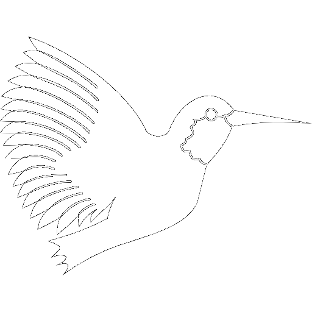
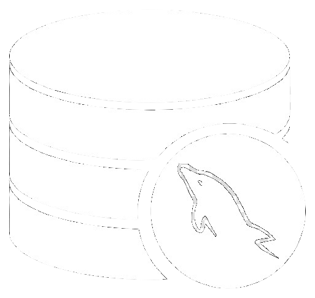
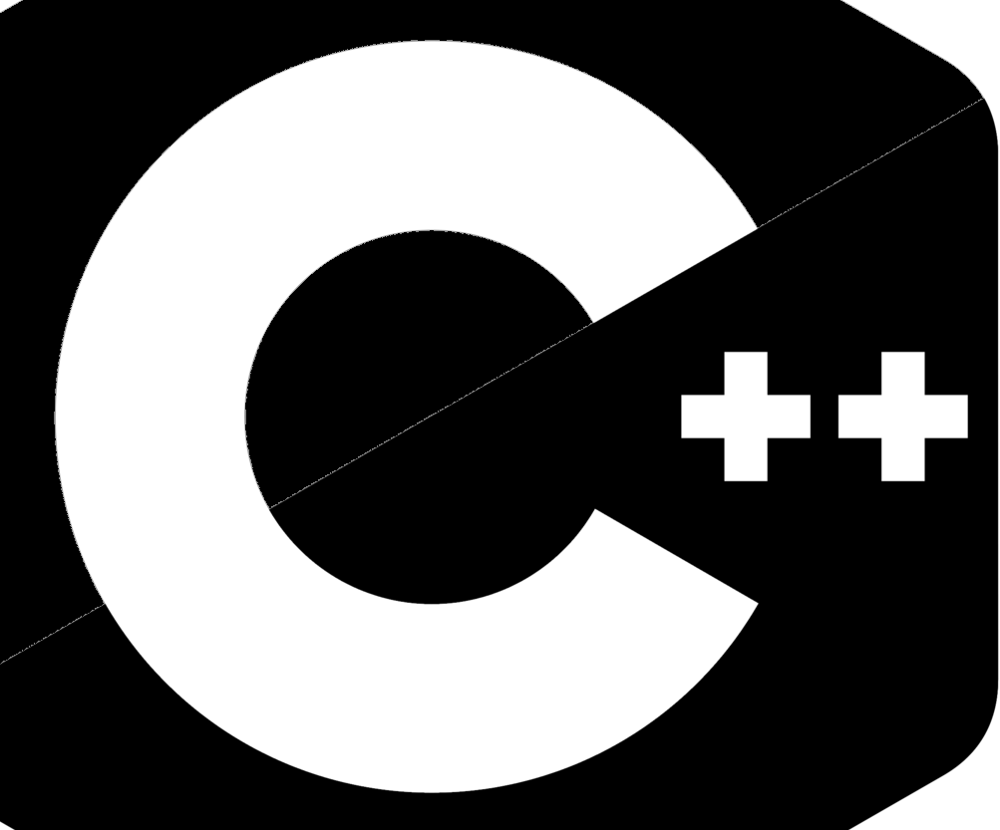

# Portfolio

© *Juan Fernandez*  

juan.fernandez.sea@gmail.com

 

Analyzing problems, finding root-cause and determining solutions by means of statistical analysis and building prediction and visualization methods using Python, MySQL and other tools. 

 

## Goals

Python scripts mainly related to the author´s passion: maritime problems, being all of them created from an enthusiastic and self-learning process. The intention of that is able to share personal knowledge and continue to grow in the Data Analysis field.

 

## Repo Library

#### Maritime

 [Web Scraping from ShipInfo Website](https://github.com/SeaGraphData/Web-Scraping-ShipInfo)

 [AIS Analysis from Danish Maritime Authority (DMA) ](https://github.com/SeaGraphData/Danish-AIS-Data-Analysis)

#### General

 [Facility Costs in OOP Python script](https://github.com/SeaGraphData/Facility-Cost)
 

 

## Tools

#### [Python & Anaconda Distribution](https://www.anaconda.com/) 

*Data:* Pandas, Numpy, Xarray & BeautifulSoup

*Visualization:* Matplotlib, Seaborn, Geopandas, Folium, Plotly

*Machine Learning:* Scickit-Learn, PyTorch

 

 

#### [GIS Mapping Software](https://www.esri.com/en-us/home) 

ArcGIS Pro, QGIS & SNAP

 

#### [LaTeX](https://www.latex-project.org/) 

 

 

#### [Others]()

MySQL, PowerBI, C / C++, Git, VS Code Editor

 

 

 
 
